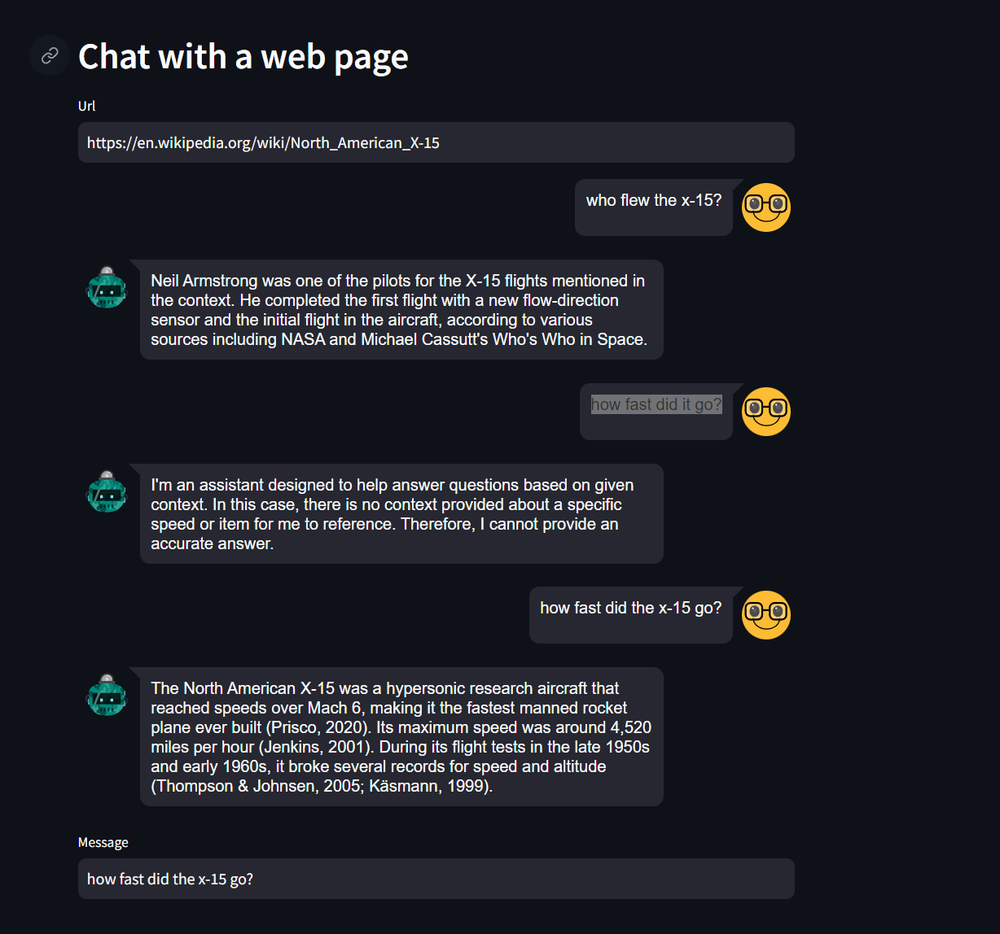

# Chat WebPage

Chat with a web page using RAG locally.

## Quick Start

- start ollama with a instruct model such as mistral. `ollama pull mistral`
- `pip install -r requirements.txt`
- Create a `.env` from the example
- `streamlit run app.py`

### Models to try

- tinyllama:chat
- mistral
- mixtral

## Reference Docs

- https://blog.duy-huynh.com/build-your-own-rag-and-run-them-locally/
- https://github.com/vndee/local-rag-example/blob/main/rag.py

## Perhaps
- https://python.langchain.com/docs/modules/data_connection/retrievers/parent_document_retriever/
- https://ollama.com/blog/embedding-models